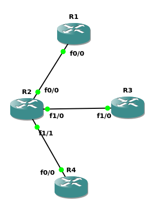

First, build a topology for ripv2: just 3 routers or more
Second, config each routers' ip addr
Third, enable the ripv2 for each router

> [RTFM](https://www.cisco.com/c/en/us/td/docs/switches/lan/catalyst9400/software/release/16-9/configuration_guide/rtng/b_169_rtng_9400_cg/configuring_rip.pdf) [STFW](https://www.netwrix.com/cisco-commands-cheat-sheet.html) ATFAI


### First, build a topology for ripv2: just 3 routers


### Second, config each routers' ip addr

example -> R2:
```bash
conf t
interface f0/0
ip addr 192.168.1.2 255.255.255.0
no shut
exit

interface f1/0
ip addr 192.168.2.1 255.255.255.0
no shut
exit

interface f1/1
ip addr 192.168.3.1 255.255.255.0
no shut
end

show ip interface brief
```

### Third, enable the ripv2 for each router
example -> R2:
```bash
conf t
router rip
version 2
network 192.168.1.0
network 192.168.2.0
network 192.168.3.0 # u may find that R2 connect to 3 subnet, so we set 3 network:)
# no network A.B.C.D

end
show ip route
```

now u can ping some ipv4 addr to test

### Some problems u might meet
1. why i fail to ping, which should be success?
2. why `show ip route rip` return nothing(i mean no rip rows)

Solutions:
- `show ip interface brief` to check the interface is enabled?
- `show ip interface brief` to check the network of rip is right?
  - if not, u can use `no network` to update
- rip will update each 30 seconds, so maybe 30s later, everything gonna be okay~

### Another question
as u see, the R2 is directly connected to any subnet in this network topology
diagram, so why should R2 run RIP or OSPF protocol?
- the answer may be: if R2 doesn't run them, the other routers may NOT learn
those routing information though R2

#### How to check it?
R2:
```bash
conf t
no router rip
 # or
no router ospf process-id

# check if they are closed
show ip protocols
show ip ospf
# if u can not find RIP or OSPF in output, then they are closed
```

then u can check the necessity of running RIP or OSPF on R2, by `ping`
or `show ip route`

Congratulations! u just solve a question by self designing a sub-experiment~
