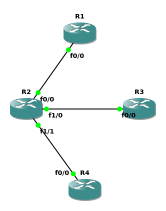

this part is very similar to ripv2

First, build a topology for ospf: just 3 routers or more
Second, config each routers' ip addr
Third, config the ospf for each router

> [RTFM](https://www.cisco.com/c/en/us/td/docs/ios-xml/ios/iproute_ospf/configuration/xe-16/iro-xe-16-book/iro-cfg.html) ATFAI


### First, build a topology for ripv2: just 3 routers


### Second, config each routers' ip addr

example -> R2:
```bash
conf t
interface f0/0
ip addr 192.168.1.2 255.255.255.0
no shut
exit

interface f1/0
ip addr 192.168.2.1 255.255.255.0
no shut
exit

interface f1/1
ip addr 192.168.3.1 255.255.255.0
no shut
end

show ip interface brief
```

### Third, config the ospf for each router
example -> R2:
```bash
conf t
router ospf 1 # router ospf process-id
# network ip-address wildcard-mask area area-id
#                                       area 0 is the top area
network 192.168.1.0 0.0.0.255 area 0
network 192.168.2.0 0.0.0.255 area 0
network 192.168.3.0 0.0.0.255 area 0
end
show ip route ospf # just wait about 1 minute
```

now u can ping some ipv4 addr to test

### Some problems u might meet
1. why i fail to ping, which should be success?
2. why `show ip route ospf` return nothing(i mean no ospf rows)

Solutions:
- `show ip interface brief` to check the interface is enabled?
- `show ip interface brief` to check the network of ospf is right?
  - if not, u can use `no network` to update
- Similarly, it will cost some time(maybe 1 min) to init ospf, so wait silently:)
