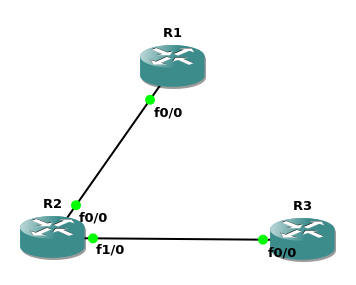

this part is very similar to ripv2 too.

First, build a topology for ospf: just 3 routers or more
Second, config each routers' ip addr
Third, config the static routing for each router

> [RTFM](https://www.cisco.com/c/en/us/td/docs/switches/datacenter/nexus9000/sw/7-x/unicast/configuration/guide/b_Cisco_Nexus_9000_Series_NX-OS_Unicast_Routing_Configuration_Guide_7x/b_Cisco_Nexus_9000_Series_NX-OS_Unicast_Routing_Configuration_Guide_7x_chapter_01101.pdf) [STFW](https://www.cisco.com/c/en/us/support/docs/dial-access/floating-static-route/118263-technote-nexthop-00.html) ATFAI


### First, build a topology for static-route: just 3 routers


### Second, config each routers' ip addr

nothing new, so i omit this part

### Third, config the static-route for each router
example -> R1:
```bash
conf t
# ip route ip-addr ip-mask {[next-hop-ip(opposite)]|[interface next-hop(self)]}
ip route 192.168.2.0 255.255.255.0 192.168.1.2
 # or
ip route 192.168.2.0 255.255.255.0 f0/0
end
show ip route static
```

if u configurate by mistake, u can use `no ip route ...` to fix bugs
```bash
conf t
no ip route 192.168.2.0 255.255.255.0 f0/0
```

now u can ping some ipv4 addr to test

### Some problems u might meet
1. why i fail to ping, which should be success?
2. why `show ip route static` return nothing(i mean no static-routing rows)

Solutions:
- `show ip interface brief` to check the interface is enabled?
- `show ip interface brief` to check the next-hop is right?
  - if not, u can use `no ip route ...` to update
