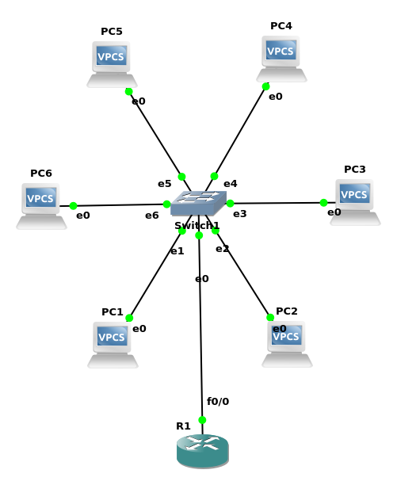

```bash
+++++++++++++++++++++++++++++++++++
|   Router (Trunk: connect VLAN)  |
+++++++++++++++++++++++++++++++++++
|    Switch (VLAN: divide LAN)    |
+++++++++++++++++++++++++++++++++++
|          Hub (just LAN)         |
+++++++++++++++++++++++++++++++++++
```

### First, WTF is VLAN?
Obviously, VLAN is Virtual Local Area Network, so, there are 2 questions:
  - what is Virtual?
  - what is Local Area Network?

#### What is Virtual?
According to [CollinsDictionary](https://www.collinsdictionary.com/zh/dictionary/english/virtual), 'virtual' should mean this: 

> You can use virtual to indicate that something is so nearly true that for most purposes it can be regarded as true. 

Therefore, 'Virtual' here means it **build a higher abstract layer on LAN** so that it seems there are serveral LAN, but physically NOT.

Given that the word 'Virtual' is not only used here, but it's also used in Operating-System, like Virtual Memory. I want to modify the translation of it, i think it accuratly means `就像是真的一样的的内存`, but it's so long that we have to call it `虚拟内存` for convience of speaking.

#### What is LAN(Local Area Network)?
As we all know, Hub works on physical layer,**those devices connected by Hub is LAN**,and Switch, which works on Data-Linking layer, will divide LANs

### How can we connect LAN with VLAN protocol?
We can set vlan-number on the port of switch, VLAN protocol will build an abstract layer for those LAN owns the same vlan-number.
And fortunately it's very easy to setup vlan in GNS3.



then u can check the connectivity of each vlan by ping.

---

### How to connect VLAN with Router-on-a-stick?
the topology is as above.

#### First: preparing
1. connect a router to switch
2. set the `$PORT_CONNECT_TO_ROUTER`(such as e0) as `dot1q` type (one of Truck mode)

#### Second: configurate Router
```bash
conf t
interface f0/0
no shut

exit

interface f0/0.1
encapsulation dot1Q 1
ip addr 192.168.1.1 255.255.255.0

exit

interface f0/0.2
encapsulation dot1Q 2
ip addr 192.168.2.1 255.255.255.0
```

#### Third: configurate each PC
example -> pc1
```bash
ip 192.168.1.2 24 192.168.1.1 # 192.168.1.1 is the gateway of VLAN_1
```

example -> pc3
```bash
ip 192.168.2.2 24 192.168.2.1 # 192.168.2.1 is the gateway of VLAN_2
```

then u can ping whatever u want
```bash
PC3> ping 192.168.1.2
```
