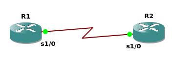

> 累了，AI代笔

广域网协议的封装（WAN Protocol Encapsulation）通常指的是在不同网络之间传输数据时，如何通过某些协议对数据进行封装，以便它们能在广域网（WAN）上进行有效传输。具体来说，这里可能涉及以下几种封装方式：

### 常见的广域网封装协议

1. **PPP（Point-to-Point Protocol）**
    PPP是点对点协议，广泛用于通过电话线、串行线等连接进行数据通信。它负责将数据封装成帧，并通过物理链路传输。
2. **HDLC（High-Level Data Link Control）**
    HDLC是一种数据链路层协议，常用于同步串行连接。它提供了可靠的数据传输，并可用于局域网或广域网。
3. **MPLS（Multiprotocol Label Switching）**
    MPLS是一种标签交换技术，用于在WAN中对数据进行封装，并通过交换机、路由器转发数据。它能够支持各种类型的网络协议并提高网络的性能。
4. **GRE（Generic Routing Encapsulation）**
    GRE封装是一种在IP网络上传输数据包的协议，广泛用于VPN或隧道协议，通过GRE隧道将其他协议封装在内传输。
5. **L2TP（Layer 2 Tunneling Protocol）**
    L2TP结合了PPP和IPSec协议，通常用于虚拟专用网络（VPN）。它通过在IP网络上传输PPP帧来实现数据封装。

### 封装的概念

封装是指将数据传输时需要的额外信息（如头部、控制信息等）附加到原始数据上，以确保数据能够在不同的网络协议间有效传输。对于广域网，通常需要对数据进行多层封装，因为数据需要通过多个路由器和网络设备，在不同的协议之间转换。

### 举个例子

假设你需要在广域网中建立一个连接。你使用PPP协议，它将你的数据包封装为PPP帧。这些PPP帧然后通过串行链路或其他物理介质进行传输，最终到达目的地。在目的地，PPP协议会将这些封装的数据提取出来，然后继续向上层传输。

### 简单理解：

- **封装**就是给数据加上一些"标签"和"头部"，确保数据能够在网络中按规则传输。
- **广域网协议的封装**指的是针对跨越远距离的网络（比如互联网）进行的数据包装过程，使得数据能在这些不同的网络环境中正常传输。


---


## PPP实操



### 1. **搭建基本拓扑**

首先，确保你有一个基本的网络拓扑，其中包括：

- 两个路由器
- 使用串行连接模拟广域网链路

### 2. **配置 PPP 封装**

假设你想在串行连接上使用 **PPP** 协议进行封装，以下是步骤：

#### 步骤 1：配置接口和 IP 地址

在两个路由器上配置串行接口，并为接口分配 IP 地址。

例如，在 **R1** 和 **R2** 上配置串行接口：

```bash
R1# configure terminal
R1(config)# interface serial1/0
R1(config-if)# ip address 192.168.1.1 255.255.255.252
R1(config-if)# no shutdown

R2# configure terminal
R2(config)# interface serial1/0
R2(config-if)# ip address 192.168.1.2 255.255.255.252
R2(config-if)# no shutdown
```

#### 步骤 2：启用 PPP 封装

在串行接口上启用 PPP 封装。

```bash
R1# configure terminal
R1(config)# interface serial1/0
R1(config-if)# encapsulation ppp
R1(config-if)# ppp chap hostname R1
R1(config-if)# ppp chap password cisco

R2# configure terminal
R2(config)# interface serial1/0
R2(config-if)# encapsulation ppp
R2(config-if)# ppp chap hostname R2
R2(config-if)# ppp chap password cisco
```

- **PPP封装**：上面两台路由器的串行接口配置为PPP封装，确保数据在传输过程中被适当封装。
- **CHAP认证**：PPP协议通常使用CHAP（挑战握手认证协议）进行认证，你可以在这两个路由器上设置认证信息。

#### 步骤 3：测试连通性

完成以上配置后，你可以通过下述任一命令测试路由器之间的连通性：

```bash
R1# ping 192.168.1.2
R1# show ppp all
```
