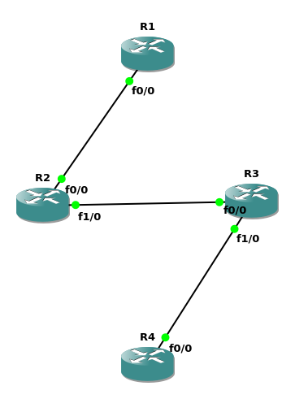

First, configurate each Router
Then, enable the RIPng for each Router

> [RTFM](https://www.cisco.com/c/en/us/td/docs/ios-xml/ios/iproute_rip/configuration/15-mt/irr-15-mt-book/ip6-rip.html) ATFAI



### First, configurate each Router
example -> R1:
```bash
conf t
ipv6 unicast-routing # 启用 IPv6 转发功能
interface f0/0
ipv6 addr 2001:db8:1::1/64
no shut

exit
show ipv6 interface b
```

### Then, enable the RIPng for each Router
example -> R1:
```bash
conf t
interface f0/0
ipv6 enable
ipv6 rip RIPng enable
```

### Check route
```bash
show ipv6 route
```

over~
