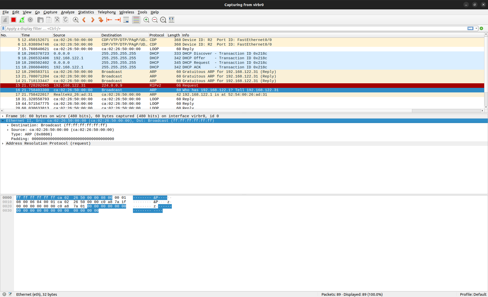
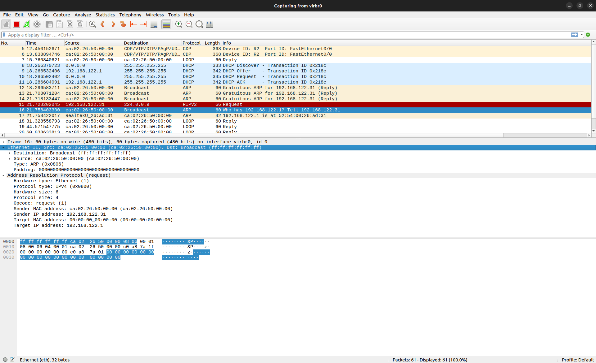
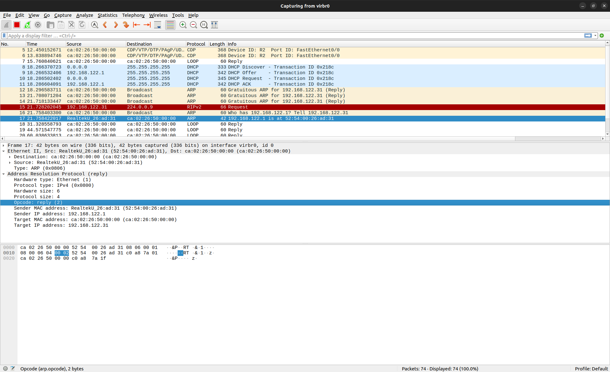
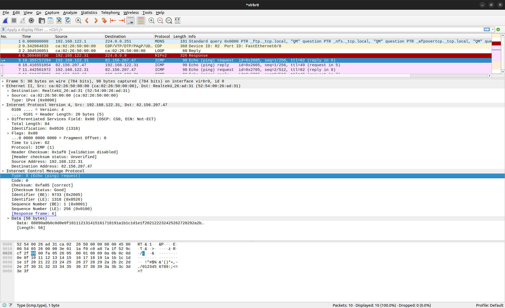
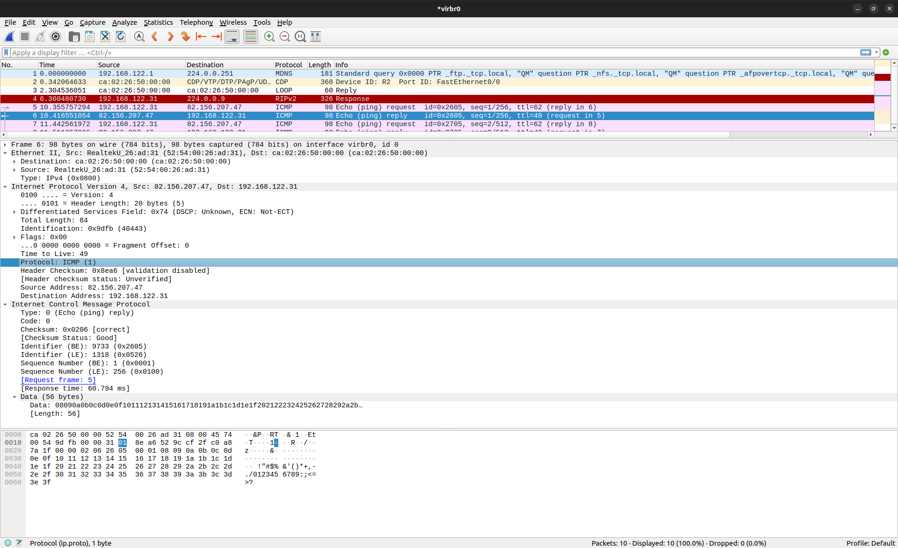

## 抓包并分析

### Ethernet



我们的网络是基于Ethernet的，也就是说上层协议在通过以太网传输时，都需要封装上一层以太网包，再将上层数据作为以太网的数据负载进行传输。

比如在本例的arp包中，

**以太网帧头**

  - **目的MAC地址** (`ff ff ff ff ff ff`): 表示广播地址，说明这是一条广播帧。
  - **源MAC地址** (`ca 02 26 50 00 00`): 表示发送该帧的设备的MAC地址是`ca 02 26 50 00 00`。
  - **以太网类型** (`08 06`): 表示该帧的上层协议类型为 ARP (`0x0806`)。

---

### ARP

ARP (Address Resolution Protocol) 是用来通过 IP 地址解析对应的 MAC 地址的协议。分为ARP请求与ARP应答两个阶段。

#### ARP请求



这是一个 ARP 请求广播帧，用于请求 `192.168.122.1` 的 MAC 地址。发送方的 IP 地址为 `192.168.122.31`，MAC 地址为 `ca:02:26:50:00:00`。目标设备的 MAC 地址未知，因此目的MAC地址设置为广播地址 `ff:ff:ff:ff:ff:ff`。

1. 以太网帧头

    - **目的MAC地址** (`ff ff ff ff ff ff`): 表示广播地址，说明这是一条广播帧。
    - **源MAC地址** (`ca 02 26 50 00 00`): 表示发送该帧的设备的MAC地址是`ca 02 26 50 00 00`。
    - **以太网类型** (`08 06`): 表示该帧的上层协议类型为 ARP (`0x0806`)。

2. 硬件类型与协议类型

    - **硬件类型** (`00 01`): 表示以太网 (Ethernet)。
    - **协议类型** (`08 00`): 表示 IPv4 协议。
    - **硬件地址长度** (`06`): 表示 MAC 地址的长度为 6 字节。
    - **协议地址长度** (`04`): 表示 IP 地址的长度为 4 字节。

3. 操作码

    - **操作码** (`00 01`): 表示 ARP 请求 (Request)。

4. 地址信息

    - **发送方硬件地址** (`ca 02 26 50 00 00`): 表示发送方的 MAC 地址。
    - **发送方协议地址** (`c0 a8 7a 1f`): 表示发送方的 IP 地址，换算为十进制即 `192.168.122.31`。
    - **目标硬件地址** (`00 00 00 00 00 00`): 目标的 MAC 地址未知（正在请求中）。
    - **目标协议地址** (`c0 a8 7a 01`): 表示目标的 IP 地址，换算为十进制即 `192.168.122.1`。

#### ARP应答



这是一个 ARP 响应（Reply）帧，表明 `192.168.122.1` 已经回应 `192.168.122.31` 的 ARP 请求。发送方的 MAC 地址为 `52:54:00:26:ad:31`，其 IP 地址是 `192.168.122.1`。目标设备的 MAC 地址是 `ca:02:26:50:00:00`，其 IP 地址是 `192.168.122.31`。

1. 以太网帧头

    - **目的 MAC 地址** (`ca 02 26 50 00 00`): 目标 MAC 地址为 `ca:02:26:50:00:00`，这是发送方设备的 MAC 地址。
    - **源 MAC 地址** (`52 54 00 26 ad 31`): 源 MAC 地址为 `52:54:00:26:ad:31`，这是接收 ARP 请求设备的 MAC 地址。
    - **以太网类型** (`08 06`): 表示上层协议是 ARP（协议类型为 `0x0806`）。

2. 硬件类型与协议类型

    - **硬件类型** (`00 01`): 表示以太网 (Ethernet)。
    - **协议类型** (`08 00`): 表示 IPv4 协议。
    - **硬件地址长度** (`06`): 表示 MAC 地址的长度为 6 字节。
    - **协议地址长度** (`04`): 表示 IP 地址的长度为 4 字节。

3. 操作码

    - **操作码** (`00 02`): 表示 ARP 响应 (Reply)。

4. 地址信息

    - **发送方硬件地址** (`52 54 00 26 ad 31`): 发送方的 MAC 地址，换算为 `52:54:00:26:ad:31`。
    - **发送方协议地址** (`c0 a8 7a 01`): 发送方的 IP 地址，换算为十进制为 `192.168.122.1`。
    - **目标硬件地址** (`ca 02 26 50 00 00`): 目标设备的 MAC 地址，换算为 `ca:02:26:50:00:00`。
    - **目标协议地址** (`c0 a8 7a 1f`): 目标设备的 IP 地址，换算为十进制为 `192.168.122.31`。

---

### ICMP

ICMP (Internet Control Message Protocol) 是用于在网络设备之间传递控制消息和错误报告的协议。它主要用于诊断网络问题和报告网络传输中的错误。ICMP分为多个类型，其中最常见的是回显请求和回显应答。

#### ICMP回显请求



这是一个从 `192.168.122.31` 向 `82.156.207.47` 发送的 **ICMP回显请求**（Ping）。数据包经过以太网传输，源和目标MAC地址分别为 `52:54:00:26:ad:31` 和 `ca:02:26:50:00:00`。IP层是IPv4，协议号为1，意味着这是一条ICMP协议的数据包。ICMP回显请求的标识符为 `0x2605`，序列号为 `0x0001`，负载部分包含了一些逐渐递增的字节。

1. 以太网帧头

    - **源MAC地址**（6字节）: `52 54 00 26 ad 31`，这通常是设备的物理地址。
    - **目的MAC地址**（6字节）: `ca 02 26 50 00 00`，这是帧发送目标设备的物理地址。
    - **类型字段**（2字节）: `08 00`，表示上层协议是IPv4（EtherType为0x0800）。

2. IPv4头

    - **版本和头部长度**（1字节）: `45`，表示IPv4，头部长度为5个32位字（即20字节）。
    - **类型服务（TOS）**（1字节）: `00`，通常是默认的服务类型。
    - **总长度**（2字节）: `00 54`，表示整个IP数据包的长度是84字节。
    - **标识**（2字节）: `05 26`，用于标识数据包，通常用于分片时识别数据包。
    - **标志和片偏移**（2字节）: `00 00`，表示没有分片。
    - **生存时间（TTL）**（1字节）: `3e`（62），TTL用于表示数据包的最大跳数，超过此值数据包将被丢弃。
    - **协议**（1字节）: `01`，表示协议为ICMP（ICMP协议号是1）。
    - **头部校验和**（2字节）: `1a f0`，校验和，用于验证IP头是否正确。
    - **源IP地址**（4字节）: `c0 a8 7a 1f`，转换为点分十进制是 `192.168.122.31`。
    - **目的IP地址**（4字节）: `52 9c cf 2f`，转换为点分十进制是 `82.156.207.47`。

3. ICMP头

    - **ICMP类型**（1字节）: `08`，表示该数据包是一个**回显请求**（Echo Request）。
    - **ICMP代码**（1字节）: `00`，表示没有额外的错误代码（通常Echo请求是0）。
    - **校验和**（2字节）: `fa 05`，用于验证ICMP数据是否完整。
    - **标识符**（2字节）: `26 05`，通常用于匹配回显请求和回显应答。
    - **序列号**（2字节）: `00 01`，用于标识回显请求的序列号。

4. ICMP数据部分：

```txt
08 09 0a 0b 0c 0d 0e 0f 10 11 12 13 14 15 16 17 18 19 1a 1b 1c 1d 1e 1f 20 21 22 23 24 25 26 27 28 29 2a 2b 2c 2d 2e 2f
```
这些数据部分通常是ICMP Echo请求的一部分，它们是用于测试的负载数据，不影响回显的响应。

#### ICMP回显应答

这个ICMP回显应答包是从 82.156.207.47（目标设备）返回到 192.168.122.31（源设备）的一条回显应答。它的内容与回显请求基本一致，ICMP类型为 00（回显应答)，标识符和序列号与请求包相同，因此它是对同一个Ping请求的响应。

这是一个ICMP回显应答包（Ping的响应），与前面的回显请求相对应。下面是对这个数据包的详细分析：

1. 以太网帧头

    - **源MAC地址**（6字节）: `52 54 00 26 ad 31`，这是发送应答数据包的设备的物理地址，通常是目标设备的MAC地址。
    - **目的MAC地址**（6字节）: `ca 02 26 50 00 00`，这是回显请求数据包的源MAC地址，即发送请求的设备的物理地址。
    - **类型字段**（2字节）: `08 00`，表示上层协议是IPv4。

2. IPv4头

    - **版本和头部长度**（1字节）: `45`，表示该数据包是IPv4，头部长度为5个32位字（即20字节）。
    - **类型服务（TOS）**（1字节）: `00`，通常是默认的服务类型。
    - **总长度**（2字节）: `00 54`，表示整个IP数据包的长度是84字节。
    - **标识**（2字节）: `9d fb`，这是数据包的标识符，通常用于分片时识别数据包。
    - **标志和片偏移**（2字节）: `00 00`，表示没有分片。
    - **生存时间（TTL）**（1字节）: `31`（49），表示TTL值，表示数据包可以经过的最大跳数，超过TTL数据包会被丢弃。
    - **协议**（1字节）: `01`，表示该数据包是ICMP协议（协议号为1）。
    - **头部校验和**（2字节）: `8e a6`，校验和，用于验证IP头的正确性。
    - **源IP地址**（4字节）: `52 9c cf 2f`，转换为点分十进制是 `82.156.207.47`，这是目标设备的IP地址，即回显请求包的目标地址。
    - **目的IP地址**（4字节）: `c0 a8 7a 1f`，转换为点分十进制是 `192.168.122.31`，这是源设备的IP地址，即回显请求包的源地址。

3. ICMP头

    - **ICMP类型**（1字节）: `00`，表示该数据包是一个**回显应答**（Echo Reply）。ICMP回显请求的类型是 `08`，而应答是 `00`。
    - **ICMP代码**（1字节）: `00`，表示没有额外的错误代码（回显应答通常是0）。
    - **校验和**（2字节）: `02 06`，用于验证ICMP数据的完整性。
    - **标识符**（2字节）: `26 05`，这与回显请求包中的标识符相同，用于匹配回显请求和回显应答。
    - **序列号**（2字节）: `00 01`，这与回显请求包中的序列号相同，表示这是同一个Ping请求的响应。

4. ICMP数据部分

```txt
08 09 0a 0b 0c 0d 0e 0f 10 11 12 13 14 15 16 17 18 19 1a 1b 1c 1d 1e 1f 20 21 22 23 24 25 26 27 28 29 2a 2b 2c 2d 2e 2f
```
数据部分和回显请求中的数据部分基本相同，通常这些数据是用于测试的负载数据。回显应答中的数据部分是与请求中相同的负载内容（这是ICMP回显请求和回显应答的标准行为）。

---

<!-- TODO -->
// u can use telnet in Cisco Router c7200

### TCP


### FTP


### HTTP
